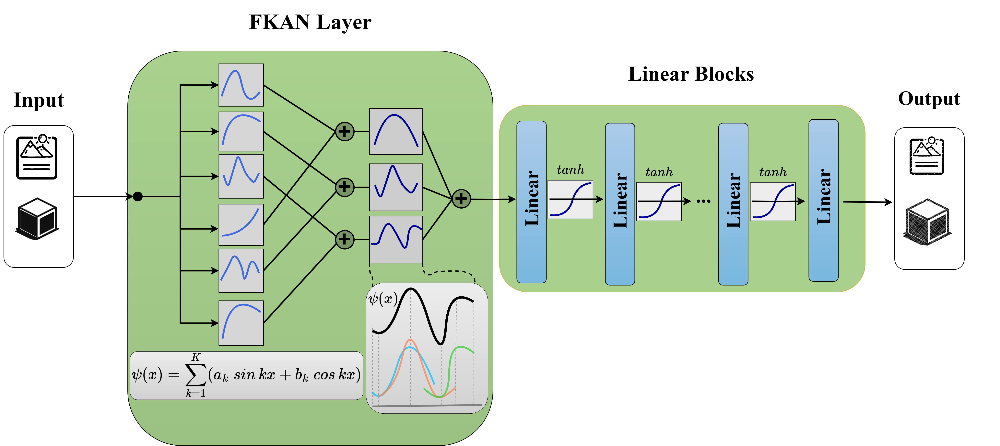

# FKAN: Implicit Neural Representations with Fourier Kolmogorov-Arnold Networks

<p align="center">
  
  <br>
</p>

This is the official Pytorch implementation of the FKAN, which is proposed in our paper ["Implicit Neural Representations with Fourier Kolmogorov-Arnold Networks"](https://arxiv.org/pdf/2409.09323) accepted for publication in *IEEE ICASSP*, 2025.

## Installation

First, check the requirements as follows:\
python\
numpy\
matplotlib\
opencv\
skimage\
torchvision\
pytorch

Then clone the repository as follows:
```shell
git clone https://github.com/Ali-Meh619/FKAN.git
```


## Description

The file "System Setup and Generating Dataset" contains the code for simulation parameters, creating the system environment and generating the training and test datasets.\
The file "MHGphormer Architecture" contains the code for the MHGphormer learning algorithm.\
The file "Loss Function and Training" contains the code for designing the loss function based on the optimization problem and the training process.\
The file "Execution" contains the code for running the model in the training and test phases.


## Citation

If you find our paper and code useful, please kindly cite our paper as follows:
```bibtex
@INPROCEEDINGS{samba,
  author={Mehrabian, Ali and Mojarad Adi, Parsa and Heidari, Moein and Hacihaliloglu, Ilker},
  booktitle={Proc. IEEE Int. Conf. Acoust., Speech, Signal Process. (ICASSP)}, 
  title={Implicit Neural Representations with Fourier Kolmogorov-Arnold Networks}, 
  year={2025},
address={Hyderabad, India},
month={Apr.}}
```

## Contact

Please feel free to contact us if you have any questions:
- Ali Mehrabian: alimehrabian619@{ece.ubc.ca, yahoo.com}

